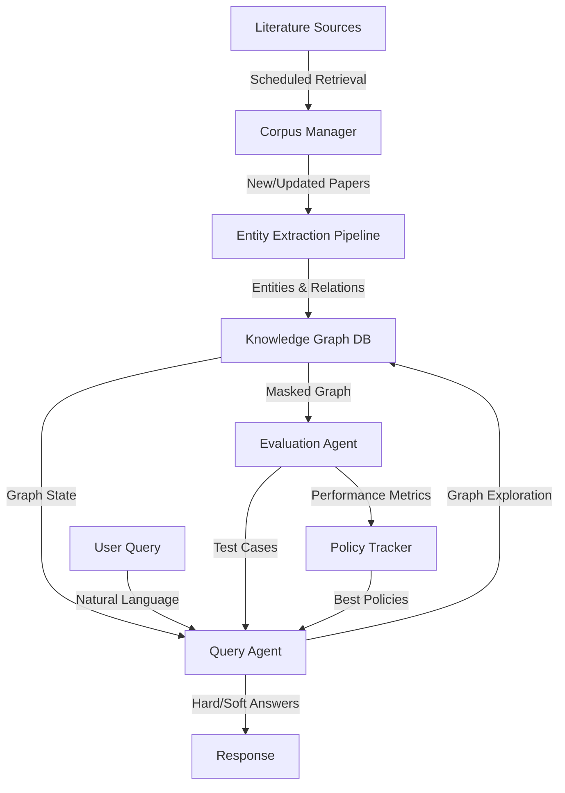
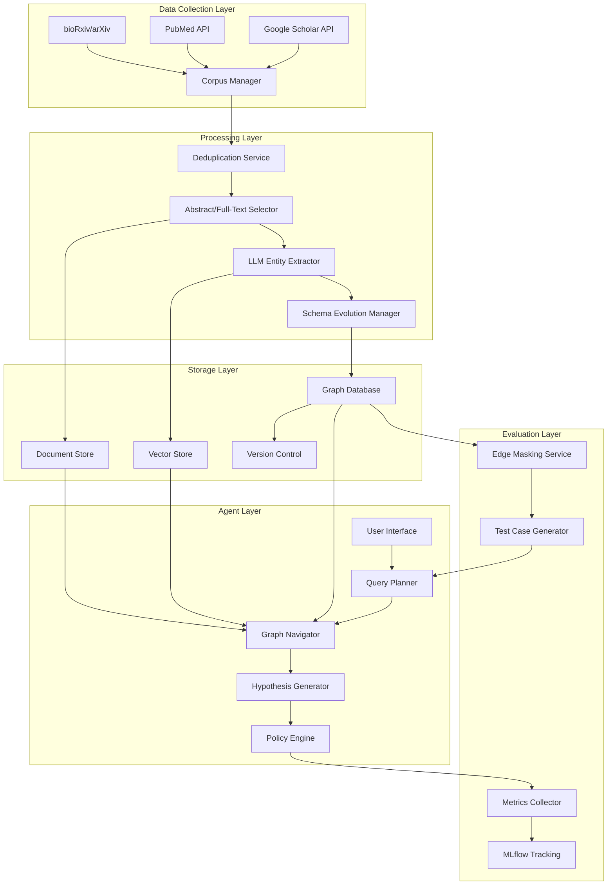

# Domain-Specific Knowledge Graph Construction and Agent-Driven Querying System
## Technical Specification Document

**Version:** 1.0  
**Date:** February 10, 2026  
**Author:** Dylan  
**Project Status:** Planning Phase

---

## Table of Contents

1. [Executive Summary](#executive-summary)
2. [System Overview](#system-overview)
3. [Architecture](#architecture)
4. [Component Specifications](#component-specifications)
5. [Data Models](#data-models)
6. [Agent Design](#agent-design)
7. [Evaluation Framework](#evaluation-framework)
8. [Implementation Phases](#implementation-phases)
9. [Infrastructure Requirements](#infrastructure-requirements)
10. [Future Directions](#future-directions)

---

## Executive Summary

### Project Vision

Build an autonomous system that constructs domain-specific knowledge graphs from scientific literature and uses LLM agents to perform sophisticated graph-based reasoning. The system emphasizes exploratory discovery, fuzzy reasoning over incomplete graphs, and self-improving agent policies.

### Core Objectives

1. **Automated KG Construction**: Extract entities and relationships from scientific literature with minimal human curation
2. **Agent-Driven Querying**: Enable natural language questions that translate into multi-hop graph exploration
3. **Hypothesis Generation**: Support "soft" reasoning that imputes missing relationships based on graph context
4. **Self-Evaluation**: Agents develop and test their own reasoning strategies through competitive policy iteration

### Initial Domain Focus

Gene Regulatory Networks (GRNs) in biotech/gene editing, focusing on:
- Genes, RNAs, and their regulatory relationships
- Activation/inhibition mechanisms
- Differential expression patterns
- Tissue/organ/cell-type contexts

### Success Metrics

- **Reconstruction Accuracy**: Agents successfully rediscover intentionally masked high-confidence edges
- **Hypothesis Quality**: Novel predictions validated through literature review or experimental confirmation
- **Policy Evolution**: Measurable improvement in agent reasoning strategies over time
- **Scalability**: System handles 10s-100s GB corpus with acceptable latency

---

## System Overview

### High-Level Workflow



### System Components

1. **Literature Retrieval System**: Queries academic databases, manages corpus updates
2. **Entity Extraction Pipeline**: LLM-based extraction of entities and relationships
3. **Knowledge Graph Database**: Versioned graph storage with provenance tracking
4. **Query Agent**: Translates natural language to graph exploration plans
5. **Evaluation Framework**: Self-testing system with edge masking and policy competition
6. **Policy Management**: Tracks agent reasoning strategies and performance

---

## Architecture

### System Architecture Diagram



### Technology Stack

#### Core Components
- **Graph Database**: Neo4j (popular, mature, good Python support)
- **Vector Store**: Pinecone or Chroma (for semantic entity similarity)
- **Document Store**: MongoDB (for raw paper storage with metadata)
- **LLM Provider**: Anthropic Claude API (primary), with fallback to open-source models

#### Development & Deployment
- **Language**: Python 3.11+
- **Agent Framework**: LangGraph or custom agentic framework
- **Experiment Tracking**: MLflow
- **Containerization**: Docker
- **Orchestration**: Kubernetes (cloud deployment)
- **CI/CD**: GitHub Actions

#### Supporting Libraries
- **Graph Processing**: NetworkX, py2neo
- **NLP**: spaCy, transformers
- **API Clients**: scholarly, biopython
- **Data Processing**: pandas, polars
- **Testing**: pytest, hypothesis

---

## Component Specifications

### 1. Literature Retrieval System

#### Responsibilities
- Query multiple academic databases on a schedule
- Download abstracts (and optionally full text)
- Detect and deduplicate papers across sources
- Trigger extraction pipeline for new content

#### API Integrations

**Google Scholar**
```python
from scholarly import scholarly

class ScholarRetriever:
    def search_papers(self, query: str, max_results: int = 100) -> List[Paper]:
        """Search Google Scholar for papers matching query"""
        pass
    
    def get_paper_metadata(self, paper_id: str) -> PaperMetadata:
        """Retrieve detailed metadata for a specific paper"""
        pass
```

**PubMed**
```python
from Bio import Entrez

class PubMedRetriever:
    def search_biomedical(self, query: str, date_range: tuple) -> List[Paper]:
        """Search PubMed with MeSH terms and date filters"""
        pass
    
    def fetch_abstracts(self, pmids: List[str]) -> List[Abstract]:
        """Bulk fetch abstracts by PMID"""
        pass
```

**Preprint Servers**
```python
class PreprintRetriever:
    def search_biorxiv(self, query: str) -> List[Paper]:
        """Search bioRxiv/medRxiv preprints"""
        pass
    
    def check_publication_status(self, doi: str) -> Optional[str]:
        """Check if preprint has been officially published"""
        pass
```

#### Deduplication Strategy

```python
class Deduplicator:
    def __init__(self):
        self.title_threshold = 0.9  # Fuzzy match similarity
        self.doi_registry = set()
    
    def is_duplicate(self, paper: Paper) -> bool:
        """
        Check if paper is duplicate using:
        1. DOI exact match
        2. Title fuzzy match (Levenshtein distance)
        3. Author overlap + year + venue
        """
        pass
    
    def link_preprint_to_publication(self, preprint: Paper, published: Paper):
        """Create bidirectional link between preprint and published version"""
        pass
```

#### Scheduling & Incremental Updates

```python
class CorpusUpdateScheduler:
    def __init__(self, schedule: str = "weekly"):
        self.schedule = schedule
        self.last_update = None
    
    async def run_scheduled_update(self):
        """
        1. Query all sources for papers since last_update
        2. Deduplicate new papers
        3. Emit event to trigger extraction pipeline
        """
        pass
    
    def emit_extraction_event(self, new_papers: List[Paper]):
        """Trigger entity extraction for new corpus additions"""
        pass
```

---

### 2. Entity Extraction Pipeline

#### Extraction Agent Design

```python
from anthropic import Anthropic

class EntityExtractionAgent:
    def __init__(self, model: str = "claude-sonnet-4-20250514"):
        self.client = Anthropic()
        self.model = model
        self.schema = self.load_current_schema()
    
    async def extract_entities(self, text: str) -> ExtractionResult:
        """
        Extract entities and relationships from paper text.
        
        Prompt includes:
        - Current schema (evolving)
        - Domain context (GRN focus)
        - Output format (structured JSON)
        - Confidence scoring
        """
        prompt = self._build_extraction_prompt(text)
        response = await self.client.messages.create(
            model=self.model,
            messages=[{"role": "user", "content": prompt}],
            max_tokens=4096
        )
        return self._parse_extraction_result(response)
    
    def _build_extraction_prompt(self, text: str) -> str:
        return f"""
        You are extracting biological entities and relationships from scientific text.
        
        Current Schema: {self.schema}
        
        Text to analyze:
        {text}
        
        Extract:
        1. Entities (genes, RNAs, proteins, pathways, diseases, cell types, tissues)
        2. Relationships (activates, inhibits, expressed_in, regulates, etc.)
        3. Context (experimental conditions, species, tissue/cell type)
        4. Evidence strength (direct observation, inference, hypothesis)
        
        Output as structured JSON with confidence scores (0-1).
        """
```

#### Schema Evolution

```python
class SchemaEvolutionManager:
    def __init__(self, graph_db):
        self.graph = graph_db
        self.entity_types = set()
        self.relationship_types = set()
    
    def update_schema(self, extraction_result: ExtractionResult):
        """
        Continuously evolve schema based on newly discovered entity/relation types.
        
        Strategy:
        1. New entity types added if seen >N times across papers
        2. New relationship types validated by LLM before addition
        3. Schema versioned in graph DB
        """
        for entity in extraction_result.entities:
            if entity.type not in self.entity_types:
                if self._validate_new_entity_type(entity.type):
                    self.entity_types.add(entity.type)
                    self.graph.create_entity_type(entity.type)
        
        for relation in extraction_result.relationships:
            if relation.type not in self.relationship_types:
                if self._validate_new_relation_type(relation.type):
                    self.relationship_types.add(relation.type)
                    self.graph.create_relationship_type(relation.type)
    
    def _validate_new_entity_type(self, entity_type: str) -> bool:
        """Ask LLM if this is a valid biological entity type"""
        pass
    
    def _validate_new_relation_type(self, relation_type: str) -> bool:
        """Ask LLM if this is a valid biological relationship"""
        pass
```

#### Initial GRN Schema

```python
INITIAL_SCHEMA = {
    "entity_types": [
        "Gene",
        "mRNA",
        "miRNA",
        "lncRNA",
        "Protein",
        "Pathway",
        "CellType",
        "Tissue",
        "Organ",
        "Disease",
        "Species"
    ],
    "relationship_types": [
        "activates",
        "inhibits",
        "regulates",
        "transcribes_to",
        "translates_to",
        "expressed_in",
        "upregulated_in",
        "downregulated_in",
        "part_of",
        "associated_with"
    ],
    "context_attributes": [
        "experimental_method",
        "tissue_context",
        "cell_type_context",
        "species",
        "condition",
        "evidence_strength"
    ]
}
```

#### Batch Processing

```python
class ExtractionPipeline:
    def __init__(self, batch_size: int = 10):
        self.batch_size = batch_size
        self.agent = EntityExtractionAgent()
    
    async def process_corpus_update(self, new_papers: List[Paper]):
        """
        Process new papers in batches with error handling and retry logic.
        """
        batches = self._create_batches(new_papers, self.batch_size)
        
        for batch in batches:
            results = await asyncio.gather(
                *[self.agent.extract_entities(paper.abstract) for paper in batch],
                return_exceptions=True
            )
            
            for paper, result in zip(batch, results):
                if isinstance(result, Exception):
                    self._log_extraction_error(paper, result)
                else:
                    self._store_extraction_result(paper, result)
```

---

### 3. Knowledge Graph Database

#### Graph Schema & Data Model

```cypher
// Node Types (evolving)
CREATE CONSTRAINT gene_id IF NOT EXISTS FOR (g:Gene) REQUIRE g.id IS UNIQUE;
CREATE CONSTRAINT rna_id IF NOT EXISTS FOR (r:RNA) REQUIRE r.id IS UNIQUE;
CREATE CONSTRAINT protein_id IF NOT EXISTS FOR (p:Protein) REQUIRE p.id IS UNIQUE;

// Relationship Properties
// All relationships include:
// - confidence: float (0-1)
// - evidence: list of paper IDs
// - extraction_date: timestamp
// - version: int

// Example: Gene Regulation
(:Gene)-[:ACTIVATES {
    confidence: 0.85,
    evidence: ["pmid:12345", "pmid:67890"],
    context: {
        tissue: "liver",
        cell_type: "hepatocyte",
        condition: "high glucose"
    },
    extraction_date: "2026-02-10",
    version: 1
}]->(:Gene)
```

#### Versioning Strategy

```python
class VersionedGraphDB:
    def __init__(self, neo4j_uri: str):
        self.driver = GraphDatabase.driver(neo4j_uri)
        self.current_version = self._get_latest_version()
    
    def add_relationship(self, source_id: str, target_id: str, 
                        rel_type: str, properties: dict):
        """
        Add relationship with automatic versioning.
        Creates delta record for efficient version tracking.
        """
        with self.driver.session() as session:
            # Increment version
            new_version = self.current_version + 1
            
            # Add relationship with version metadata
            session.run("""
                MATCH (a {id: $source_id}), (b {id: $target_id})
                CREATE (a)-[r:%s {
                    confidence: $confidence,
                    evidence: $evidence,
                    version: $version,
                    created_at: datetime()
                }]->(b)
                """ % rel_type,
                source_id=source_id,
                target_id=target_id,
                confidence=properties.get('confidence', 0.5),
                evidence=properties.get('evidence', []),
                version=new_version
            )
            
            # Record delta for version control
            self._record_delta(new_version, "ADD_RELATIONSHIP", {
                "source": source_id,
                "target": target_id,
                "type": rel_type,
                "properties": properties
            })
    
    def _record_delta(self, version: int, operation: str, details: dict):
        """Store minimal delta for efficient version reconstruction"""
        pass
    
    def rollback_to_version(self, target_version: int):
        """Reconstruct graph at specific version using deltas"""
        pass
```

#### Provenance Tracking

```python
class ProvenanceTracker:
    """
    Maintain bidirectional links between KG elements and source papers.
    """
    def link_entity_to_paper(self, entity_id: str, paper_id: str, 
                            sentence: str, confidence: float):
        """
        Create provenance link:
        (Entity)-[:EXTRACTED_FROM {sentence, confidence}]->(Paper)
        """
        pass
    
    def get_evidence_for_relationship(self, rel_id: str) -> List[Evidence]:
        """
        Retrieve all papers/sentences that support a relationship.
        Returns sorted by confidence.
        """
        pass
    
    def trace_entity_evolution(self, entity_id: str) -> Timeline:
        """Show how entity's properties/relationships changed over corpus versions"""
        pass
```

#### Hypothetical Edge Management

```python
class HypotheticalEdgeManager:
    """
    Manage tentative/predicted relationships with confidence thresholds.
    """
    def __init__(self, confidence_threshold: float = 0.7):
        self.threshold = confidence_threshold
    
    def add_hypothetical_edge(self, source_id: str, target_id: str,
                             rel_type: str, confidence: float,
                             reasoning: str):
        """
        Add edge with 'hypothetical' flag.
        Edge marked as :HYPOTHETICAL_ACTIVATES instead of :ACTIVATES
        """
        with self.driver.session() as session:
            session.run(f"""
                MATCH (a {{id: $source_id}}), (b {{id: $target_id}})
                CREATE (a)-[r:HYPOTHETICAL_{rel_type} {{
                    confidence: $confidence,
                    reasoning: $reasoning,
                    created_at: datetime(),
                    validation_attempts: 0
                }}]->(b)
                """,
                source_id=source_id,
                target_id=target_id,
                confidence=confidence,
                reasoning=reasoning
            )
    
    def promote_hypothesis_to_fact(self, rel_id: str):
        """
        Convert hypothetical edge to standard edge when confidence exceeds threshold.
        Implements Hebbian-like learning: repeated validation increases confidence.
        """
        pass
    
    def validate_hypothesis(self, rel_id: str, validation_result: bool):
        """
        Update confidence based on validation outcome.
        Increase if validated, decrease if contradicted.
        """
        pass
```

---

### 4. Query Agent Design

#### Agent Architecture

```python
class KnowledgeGraphQueryAgent:
    def __init__(self, graph_db, policy_file: str = None):
        self.graph = graph_db
        self.client = Anthropic()
        self.policy = self.load_policy(policy_file) if policy_file else self.default_policy()
        self.execution_log = []
    
    async def answer_query(self, user_query: str, mode: str = "soft") -> Answer:
        """
        Main entry point for query processing.
        
        Args:
            user_query: Natural language question
            mode: "hard" (only verified edges) or "soft" (include hypotheses)
        
        Returns:
            Answer object with reasoning trace
        """
        # Phase 1: Query Understanding
        query_plan = await self._create_query_plan(user_query)
        
        # Phase 2: Graph Exploration
        if mode == "hard":
            results = self._execute_hard_query(query_plan)
        else:
            results = await self._execute_soft_query(query_plan)
        
        # Phase 3: Answer Synthesis
        answer = await self._synthesize_answer(user_query, results)
        
        # Log execution for policy learning
        self._log_execution(user_query, query_plan, results, answer)
        
        return answer
    
    async def _create_query_plan(self, user_query: str) -> QueryPlan:
        """
        Convert natural language to graph exploration strategy.
        
        Example:
        Query: "What genes regulate BRCA1 in breast tissue?"
        Plan:
          1. Find node: Gene(name="BRCA1")
          2. Find incoming edges: (:Gene)-[:REGULATES]->(:Gene{name="BRCA1"})
          3. Filter by context: tissue="breast"
          4. Return source nodes with evidence
        """
        prompt = f"""
        You are a knowledge graph query planner for a gene regulatory network.
        
        Convert this natural language query into a graph exploration plan:
        "{user_query}"
        
        Current policy guidance:
        {self.policy}
        
        Output a structured plan with:
        1. Entity resolution (which nodes to find)
        2. Path patterns (what relationships to traverse)
        3. Filters (context, confidence thresholds)
        4. Aggregation strategy
        
        Format as JSON.
        """
        
        response = await self.client.messages.create(
            model="claude-sonnet-4-20250514",
            messages=[{"role": "user", "content": prompt}],
            max_tokens=2048
        )
        
        return QueryPlan.from_json(response.content[0].text)
```

#### Hard Query Execution

```python
def _execute_hard_query(self, plan: QueryPlan) -> QueryResults:
    """
    Execute query using only high-confidence, verified edges.
    No hypothesis generation.
    """
    cypher_query = self._plan_to_cypher(plan, include_hypothetical=False)
    
    with self.graph.driver.session() as session:
        results = session.run(cypher_query, **plan.parameters)
        
        return QueryResults(
            nodes=[record["node"] for record in results],
            paths=[record["path"] for record in results],
            evidence=self._gather_evidence(results),
            mode="hard"
        )

def _plan_to_cypher(self, plan: QueryPlan, include_hypothetical: bool) -> str:
    """
    Translate QueryPlan to Cypher query.
    
    If include_hypothetical=True, also match HYPOTHETICAL_* relationships.
    """
    pass
```

#### Soft Query Execution (Hypothesis Generation)

```python
async def _execute_soft_query(self, plan: QueryPlan) -> QueryResults:
    """
    Execute query with hypothesis generation for missing edges.
    
    Strategy:
    1. Execute hard query first
    2. Identify gaps in the result graph
    3. Generate hypotheses to fill gaps
    4. Score hypotheses by plausibility
    5. Return combined results with confidence indicators
    """
    # Get verified results
    hard_results = self._execute_hard_query(plan)
    
    # Identify missing connections
    gaps = self._identify_gaps(hard_results, plan)
    
    # Generate hypotheses for each gap
    hypotheses = []
    for gap in gaps:
        hypothesis = await self._generate_hypothesis(gap)
        hypotheses.append(hypothesis)
    
    # Combine and rank
    combined = self._merge_results(hard_results, hypotheses)
    
    return QueryResults(
        nodes=combined.nodes,
        paths=combined.paths,
        evidence=combined.evidence,
        hypotheses=hypotheses,
        mode="soft"
    )

async def _generate_hypothesis(self, gap: Gap) -> Hypothesis:
    """
    Generate plausible relationship for missing edge.
    
    Uses:
    1. Graph embeddings for semantic similarity
    2. Path patterns (if A->B and B->C, maybe A->C?)
    3. LLM reasoning over local graph context
    """
    # Get local subgraph around gap
    context_subgraph = self._get_local_context(gap.source, gap.target, hops=2)
    
    # Ask LLM to hypothesize relationship
    prompt = f"""
    Given this local knowledge graph context:
    {context_subgraph.to_text()}
    
    Is there a plausible relationship between {gap.source} and {gap.target}?
    If so, what type of relationship and why?
    
    Provide:
    1. Relationship type (or "none")
    2. Confidence (0-1)
    3. Reasoning based on graph patterns
    """
    
    response = await self.client.messages.create(
        model="claude-sonnet-4-20250514",
        messages=[{"role": "user", "content": prompt}],
        max_tokens=1024
    )
    
    hypothesis_data = self._parse_hypothesis_response(response)
    
    # Store hypothesis in graph
    if hypothesis_data['relationship_type'] != "none":
        self.graph.hypothetical_edges.add_hypothetical_edge(
            gap.source.id,
            gap.target.id,
            hypothesis_data['relationship_type'],
            hypothesis_data['confidence'],
            hypothesis_data['reasoning']
        )
    
    return Hypothesis(**hypothesis_data)
```

#### Multi-Hop Reasoning

```python
class MultiHopReasoner:
    """
    Traverse multi-hop paths to answer complex queries.
    """
    def __init__(self, graph_db, max_hops: int = 5):
        self.graph = graph_db
        self.max_hops = max_hops
    
    def find_paths(self, source_id: str, target_id: str, 
                   relationship_types: List[str] = None) -> List[Path]:
        """
        Find all paths between source and target within max_hops.
        
        Example:
        Question: "How does vitamin D affect bone density?"
        Path: (VitaminD)-[:ACTIVATES]->(VDR)-[:REGULATES]->(RANKL)
              -[:INHIBITS]->(Osteoclast)-[:AFFECTS]->(BoneDensity)
        """
        cypher = """
        MATCH path = (source {id: $source_id})-[*1..%d]-(target {id: $target_id})
        WHERE ALL(r IN relationships(path) WHERE type(r) IN $rel_types OR $rel_types IS NULL)
        RETURN path, 
               [r IN relationships(path) | r.confidence] AS confidences,
               reduce(conf = 1.0, c IN [r IN relationships(path) | r.confidence] | conf * c) AS path_confidence
        ORDER BY path_confidence DESC
        LIMIT 10
        """ % self.max_hops
        
        with self.graph.driver.session() as session:
            results = session.run(
                cypher,
                source_id=source_id,
                target_id=target_id,
                rel_types=relationship_types
            )
            
            return [self._path_from_record(r) for r in results]
    
    def explain_path(self, path: Path) -> str:
        """Generate natural language explanation of a multi-hop path"""
        pass
```

---

### 5. Agent Policy System

#### Policy Representation

```python
class AgentPolicy:
    """
    Human-readable markdown file encoding agent's reasoning strategy.
    """
    def __init__(self, policy_file: str):
        self.policy_file = policy_file
        self.version = 1
        self.strategies = {}
        self.load()
    
    def load(self):
        """Parse markdown policy file into structured strategies"""
        with open(self.policy_file, 'r') as f:
            content = f.read()
            self.strategies = self._parse_policy_markdown(content)
    
    def _parse_policy_markdown(self, content: str) -> dict:
        """
        Parse policy markdown into actionable strategies.
        
        Expected format:
        # Agent Policy v1
        
        ## Query Planning Strategy
        - For gene regulation queries, prioritize tissue-specific contexts
        - When entities are ambiguous, explore all candidates in parallel
        
        ## Hypothesis Generation Strategy
        - Use path transitivity for activation/inhibition chains
        - Require at least 2 intermediate nodes for long-range predictions
        - Weight semantic similarity at 0.3, structural similarity at 0.7
        
        ## Confidence Calibration
        - Direct edges: baseline 0.8
        - 2-hop inference: multiply confidences, apply 0.9 penalty
        - 3+ hop inference: multiply confidences, apply 0.7 penalty
        """
        pass
    
    def update_strategy(self, strategy_name: str, new_content: str):
        """Update specific strategy and increment version"""
        self.strategies[strategy_name] = new_content
        self.version += 1
        self.save()
    
    def save(self):
        """Write updated policy back to markdown file"""
        pass
```

#### Example Policy File

```markdown
# Knowledge Graph Query Agent Policy
**Version:** 3  
**Last Updated:** 2026-02-10  
**Performance Score:** 0.78 (avg across 50 test cases)

## Query Planning Strategy

### Entity Resolution
- When gene names are ambiguous (e.g., "p53"), query both gene and protein nodes
- Prioritize species-specific entities based on query context
- If no species specified, default to human (Homo sapiens)

### Path Exploration
- For regulatory queries, explore both direct and 2-hop paths
- For expression queries, filter by tissue/cell-type context before traversal
- Maximum path length: 4 hops (diminishing returns beyond this)

### Context Filtering
- Tissue context: always apply if mentioned in query
- Experimental method: use to boost confidence, not filter
- Species: hard filter (don't mix species unless explicitly comparative)

## Hypothesis Generation Strategy

### When to Generate Hypotheses
- Gap exists in 2-hop path (A->B and B->C known, A->C missing)
- Semantic similarity between source and target > 0.6
- At least 3 common neighbors in the graph

### Hypothesis Scoring
```
confidence = 0.3 * semantic_similarity 
           + 0.4 * structural_similarity
           + 0.3 * literature_cooccurrence
```

### Path Transitivity Rules
- Activation + Activation → Activation (confidence * 0.9)
- Activation + Inhibition → Inhibition (confidence * 0.9)
- Inhibition + Inhibition → Activation (confidence * 0.8)
- Mixed/Unknown → No inference

### Validation Priorities
- Prioritize hypotheses with confidence > 0.6 for validation
- Validate at most 5 hypotheses per query to control latency

## Confidence Calibration

### Baseline Confidences
- Direct edge from single high-quality paper: 0.7
- Direct edge from multiple papers: min(0.95, 0.7 + 0.1 * (num_papers - 1))
- 2-hop inference: product of edge confidences * 0.9
- 3-hop inference: product of edge confidences * 0.7
- 4-hop inference: product of edge confidences * 0.5

### Context Boost/Penalty
- Matching tissue context: +0.1 confidence
- Matching cell type: +0.05 confidence
- Direct experimental observation: +0.15 confidence
- Computational prediction only: -0.2 confidence

## Test Case Generation Strategy

### Edge Masking Selection
- Randomly mask 10% of edges with confidence > 0.8
- Preferentially mask edges with multiple papers (harder to rediscover)
- Ensure masked edges span diverse relationship types

### Success Criteria
- "Perfect" recovery: predicted exact relationship type, confidence within 0.1
- "Good" recovery: predicted compatible relationship type, confidence within 0.2
- "Acceptable" recovery: identified connection exists, any relationship type

### Learning from Failures
- When failing to rediscover edge, analyze:
  1. Was the information present in local context?
  2. Did semantic similarity suggest connection?
  3. What additional context would have helped?
- Update strategy if pattern of failures detected

## Performance Insights

### What Works Well
- Path transitivity for activation/inhibition chains (92% recovery rate)
- Tissue-specific filtering reduces noise significantly
- Semantic similarity effective for gene-pathway associations

### Current Weaknesses
- Struggles with indirect regulation (cofactors, scaffolding proteins)
- Overconfident on 3-hop paths (should reduce penalty further)
- Misses context-dependent relationships (need better context encoding)

### Planned Improvements
- Incorporate temporal dynamics (gene expression timing)
- Add support for negative evidence (explicitly contradicted relationships)
- Experiment with graph neural network embeddings for similarity
```

#### Policy Competition Framework

```python
class PolicyCompetition:
    """
    Pit multiple agent policies against each other on test cases.
    Track performance and evolve best strategies.
    """
    def __init__(self, graph_db, test_suite: TestSuite):
        self.graph = graph_db
        self.test_suite = test_suite
        self.agents = []
    
    def register_agent(self, agent: KnowledgeGraphQueryAgent):
        """Add agent to competition"""
        self.agents.append(agent)
    
    async def run_competition(self) -> CompetitionResults:
        """
        Run all agents on full test suite, collect metrics.
        """
        results = {}
        
        for agent in self.agents:
            agent_results = []
            
            for test_case in self.test_suite.cases:
                # Mask edges as specified by test case
                self.graph.apply_mask(test_case.masked_edges)
                
                # Run agent query
                answer = await agent.answer_query(
                    test_case.query,
                    mode=test_case.mode
                )
                
                # Evaluate against ground truth
                score = self._evaluate_answer(answer, test_case.expected)
                agent_results.append(score)
                
                # Restore graph
                self.graph.remove_mask()
            
            results[agent.policy.policy_file] = {
                'scores': agent_results,
                'mean_score': np.mean(agent_results),
                'median_score': np.median(agent_results),
                'policy_version': agent.policy.version
            }
        
        # Rank agents
        ranked = sorted(results.items(), key=lambda x: x[1]['mean_score'], reverse=True)
        
        return CompetitionResults(ranked)
    
    def _evaluate_answer(self, answer: Answer, expected: GroundTruth) -> float:
        """
        Score answer against ground truth.
        
        Metrics:
        - Entity precision/recall
        - Relationship accuracy
        - Confidence calibration (Brier score)
        - Reasoning quality (human eval placeholder)
        """
        pass
```

---

## Data Models

### Core Data Structures

```python
from dataclasses import dataclass
from typing import List, Optional, Dict, Any
from datetime import datetime

@dataclass
class Paper:
    """Represents a scientific paper in the corpus"""
    id: str  # DOI or unique identifier
    title: str
    authors: List[str]
    abstract: str
    full_text: Optional[str]
    publication_date: datetime
    venue: str  # Journal/conference name
    source: str  # "pubmed", "scholar", "biorxiv", etc.
    metadata: Dict[str, Any]
    
    def __hash__(self):
        return hash(self.id)

@dataclass
class Entity:
    """Represents a biological entity extracted from text"""
    id: str
    name: str
    type: str  # "Gene", "RNA", "Protein", etc.
    aliases: List[str]
    confidence: float
    source_paper: str
    source_sentence: str
    attributes: Dict[str, Any]

@dataclass
class Relationship:
    """Represents a relationship between two entities"""
    id: str
    source_entity: str
    target_entity: str
    type: str  # "activates", "inhibits", etc.
    confidence: float
    evidence: List[str]  # Paper IDs
    context: Dict[str, Any]  # tissue, cell_type, condition, etc.
    is_hypothetical: bool
    version: int

@dataclass
class ExtractionResult:
    """Result from entity extraction on a paper"""
    paper_id: str
    entities: List[Entity]
    relationships: List[Relationship]
    extraction_timestamp: datetime
    model_version: str

@dataclass
class QueryPlan:
    """Structured representation of a graph query"""
    entity_targets: List[Dict[str, Any]]  # Entities to find
    path_patterns: List[Dict[str, Any]]  # Relationship patterns to match
    filters: Dict[str, Any]  # Confidence, context filters
    aggregation: str  # How to combine results
    parameters: Dict[str, Any]
    
    @classmethod
    def from_json(cls, json_str: str) -> 'QueryPlan':
        pass

@dataclass
class Path:
    """A multi-hop path through the knowledge graph"""
    nodes: List[Entity]
    edges: List[Relationship]
    total_confidence: float
    explanation: str

@dataclass
class Hypothesis:
    """A hypothesized relationship"""
    source_id: str
    target_id: str
    relationship_type: str
    confidence: float
    reasoning: str
    supporting_paths: List[Path]
    validation_status: Optional[bool]

@dataclass
class QueryResults:
    """Results from a knowledge graph query"""
    nodes: List[Entity]
    paths: List[Path]
    evidence: List[Dict[str, Any]]
    hypotheses: Optional[List[Hypothesis]]
    mode: str  # "hard" or "soft"
    execution_time: float

@dataclass
class Answer:
    """Final answer to user query"""
    query: str
    response: str
    results: QueryResults
    reasoning_trace: List[str]
    confidence: float
```

---

## Evaluation Framework

### Test Suite Design

```python
class TestCase:
    """Single test case for agent evaluation"""
    def __init__(self, 
                 query: str,
                 expected_result: GroundTruth,
                 masked_edges: List[str],
                 difficulty: str):
        self.query = query
        self.expected = expected_result
        self.masked_edges = masked_edges
        self.difficulty = difficulty  # "easy", "medium", "hard"

class TestSuite:
    """Collection of test cases for agent evaluation"""
    def __init__(self):
        self.cases = []
    
    def add_case(self, test_case: TestCase):
        self.cases.append(test_case)
    
    @classmethod
    def generate_from_graph(cls, graph_db, num_cases: int = 100) -> 'TestSuite':
        """
        Automatically generate test cases from existing high-confidence edges.
        
        Strategy:
        1. Sample edges with confidence > 0.8
        2. Create query that should discover this edge
        3. Mask the edge (and optionally nearby edges for difficulty)
        4. Define expected result
        """
        suite = cls()
        
        # Get high-confidence edges
        high_conf_edges = graph_db.get_edges_by_confidence(min_conf=0.8, limit=num_cases)
        
        for edge in high_conf_edges:
            # Create query
            query = cls._generate_query_for_edge(edge)
            
            # Determine difficulty and masking strategy
            if random.random() < 0.3:  # 30% hard cases
                masked = cls._create_hard_mask(graph_db, edge)
                difficulty = "hard"
            elif random.random() < 0.5:  # 35% medium cases
                masked = cls._create_medium_mask(graph_db, edge)
                difficulty = "medium"
            else:  # 35% easy cases
                masked = [edge.id]
                difficulty = "easy"
            
            # Define expected result
            expected = GroundTruth(
                should_find_edge=True,
                edge_type=edge.type,
                confidence_range=(edge.confidence - 0.2, edge.confidence + 0.2)
            )
            
            suite.add_case(TestCase(query, expected, masked, difficulty))
        
        return suite
    
    @staticmethod
    def _generate_query_for_edge(edge: Relationship) -> str:
        """
        Generate natural language query for an edge.
        
        Examples:
        - Gene activation: "What activates {target_gene}?"
        - Regulation: "How is {target_gene} regulated in {tissue}?"
        - Pathway: "What genes are involved in {pathway}?"
        """
        pass
    
    @staticmethod
    def _create_hard_mask(graph_db, edge: Relationship) -> List[str]:
        """
        Mask edge plus nearby supporting evidence.
        Forces agent to use multi-hop reasoning or semantic similarity.
        """
        pass
```

### Evaluation Metrics

```python
class EvaluationMetrics:
    """Compute metrics for agent performance"""
    
    @staticmethod
    def entity_precision_recall(predicted: List[Entity], 
                                expected: List[Entity]) -> Dict[str, float]:
        """Standard precision/recall for entity extraction"""
        predicted_ids = set(e.id for e in predicted)
        expected_ids = set(e.id for e in expected)
        
        tp = len(predicted_ids & expected_ids)
        fp = len(predicted_ids - expected_ids)
        fn = len(expected_ids - predicted_ids)
        
        precision = tp / (tp + fp) if (tp + fp) > 0 else 0
        recall = tp / (tp + fn) if (tp + fn) > 0 else 0
        f1 = 2 * precision * recall / (precision + recall) if (precision + recall) > 0 else 0
        
        return {'precision': precision, 'recall': recall, 'f1': f1}
    
    @staticmethod
    def relationship_accuracy(predicted: List[Relationship],
                             expected: List[Relationship]) -> float:
        """
        Score relationship predictions.
        
        Scoring:
        - Exact match (same type, close confidence): 1.0
        - Compatible type (e.g., "regulates" vs "activates"): 0.5
        - Wrong type: 0.0
        """
        pass
    
    @staticmethod
    def confidence_calibration(predictions: List[Tuple[float, bool]]) -> float:
        """
        Brier score for confidence calibration.
        
        predictions: list of (predicted_confidence, was_correct)
        Lower is better (perfect calibration = 0)
        """
        brier_score = np.mean([
            (conf - float(correct))**2 
            for conf, correct in predictions
        ])
        return brier_score
    
    @staticmethod
    def hypothesis_quality(hypotheses: List[Hypothesis],
                          ground_truth: List[Relationship]) -> Dict[str, float]:
        """
        Evaluate quality of generated hypotheses.
        
        Metrics:
        - Precision: % of hypotheses that are correct
        - Recall: % of discoverable relationships found
        - Calibration: correlation between confidence and correctness
        """
        pass
```

### Automated Test Case Generation

```python
class AutomatedTestGenerator:
    """
    Agents generate their own creative test cases.
    """
    def __init__(self, graph_db, agent: KnowledgeGraphQueryAgent):
        self.graph = graph_db
        self.agent = agent
    
    async def generate_test_case(self) -> TestCase:
        """
        Ask agent to propose an interesting test case.
        
        Agent should:
        1. Identify interesting graph pattern
        2. Formulate query that tests specific reasoning capability
        3. Propose masking strategy
        4. Define expected behavior
        """
        prompt = """
        Analyze the current knowledge graph and propose a creative test case.
        
        Your test case should:
        - Target a specific reasoning capability (multi-hop inference, context sensitivity, etc.)
        - Be challenging but solvable
        - Help identify weaknesses in current policies
        
        Output format:
        {
            "query": "Natural language question",
            "reasoning_required": "What makes this hard?",
            "edges_to_mask": ["edge_id_1", "edge_id_2"],
            "expected_approach": "How should this be solved?",
            "difficulty": "easy|medium|hard"
        }
        """
        
        response = await self.agent.client.messages.create(
            model="claude-sonnet-4-20250514",
            messages=[{"role": "user", "content": prompt}],
            max_tokens=2048
        )
        
        test_data = json.loads(response.content[0].text)
        
        return TestCase(
            query=test_data['query'],
            expected_result=self._infer_expected_result(test_data),
            masked_edges=test_data['edges_to_mask'],
            difficulty=test_data['difficulty']
        )
```

### MLflow Integration

```python
import mlflow

class ExperimentTracker:
    """Track agent experiments with MLflow"""
    
    def __init__(self, experiment_name: str = "kg-agent-policies"):
        mlflow.set_experiment(experiment_name)
    
    def log_agent_run(self, agent: KnowledgeGraphQueryAgent,
                     test_results: Dict[str, Any],
                     policy_file: str):
        """
        Log agent performance as MLflow run.
        """
        with mlflow.start_run(run_name=f"policy_v{agent.policy.version}"):
            # Log parameters
            mlflow.log_param("policy_file", policy_file)
            mlflow.log_param("policy_version", agent.policy.version)
            mlflow.log_param("model", agent.client.model)
            
            # Log metrics
            mlflow.log_metric("mean_score", test_results['mean_score'])
            mlflow.log_metric("median_score", test_results['median_score'])
            mlflow.log_metric("test_cases_count", len(test_results['scores']))
            
            # Log policy file as artifact
            mlflow.log_artifact(policy_file)
            
            # Log detailed results
            mlflow.log_dict(test_results, "detailed_results.json")
    
    def compare_policies(self, run_ids: List[str]) -> pd.DataFrame:
        """Generate comparison table of different policy runs"""
        pass
```

---

## Implementation Phases

### Phase 0: Project Setup (Week 1)

**Goals:**
- Set up development environment
- Initialize repository structure
- Configure local graph database
- Establish basic CI/CD

**Deliverables:**
- Repository with standard Python project structure
- Docker Compose for local Neo4j + MongoDB
- Basic tests and linting configured
- Initial documentation

**Tasks:**
```bash
# Project structure
kg-agent-system/
├── src/
│   ├── corpus/          # Literature retrieval
│   ├── extraction/      # Entity extraction
│   ├── graph/          # Graph DB interface
│   ├── agents/         # Query agents
│   ├── evaluation/     # Test suite & metrics
│   └── utils/
├── tests/
├── policies/           # Agent policy files
├── data/              # Local data storage
├── notebooks/         # Exploratory analysis
├── docker/
├── requirements.txt
└── README.md
```

---

### Phase 1: Minimal Viable Prototype (Weeks 2-4)

**Goal:** End-to-end pipeline on toy dataset

**Scope:**
- **Corpus:** 100 papers from PubMed on BRCA1/BRCA2 gene regulation
- **Schema:** Fixed initial GRN schema (genes, RNAs, basic regulation)
- **Query:** Hard queries only (no hypothesis generation)
- **Evaluation:** Manual verification of extracted entities

**Deliverables:**
1. **Literature Retrieval:** Script to fetch 100 PubMed abstracts
2. **Entity Extraction:** LLM-based extraction with structured output
3. **Graph Construction:** Load entities/relationships into Neo4j
4. **Basic Query Agent:** Answer simple queries via Cypher generation
5. **Validation:** Human review of 20 extracted relationships

**Success Criteria:**
- 100 papers successfully retrieved and deduplicated
- >80% precision on entity extraction (manual eval on 50 entities)
- Agent correctly answers 8/10 simple factual queries
- Graph visualization shows connected components

**Code Example:**
```python
# Minimal extraction pipeline
async def mvp_pipeline():
    # Step 1: Retrieve papers
    retriever = PubMedRetriever()
    papers = retriever.search_biomedical("BRCA1 regulation", max_results=100)
    
    # Step 2: Extract entities
    extractor = EntityExtractionAgent()
    results = []
    for paper in papers:
        result = await extractor.extract_entities(paper.abstract)
        results.append(result)
    
    # Step 3: Build graph
    graph = Neo4jGraph("bolt://localhost:7687")
    for result in results:
        graph.add_entities(result.entities)
        graph.add_relationships(result.relationships)
    
    # Step 4: Query
    agent = KnowledgeGraphQueryAgent(graph)
    answer = await agent.answer_query(
        "What genes activate BRCA1?",
        mode="hard"
    )
    
    print(answer.response)
```

---

### Phase 2: Schema Evolution & Scalability (Weeks 5-7)

**Goal:** Scale to 1000+ papers with evolving schema

**Enhancements:**
- Expand corpus to 1,000 papers (broader gene regulation topics)
- Implement schema evolution manager
- Add batch processing for extraction
- Introduce versioning for graph
- Add provenance tracking

**Deliverables:**
1. **Corpus Manager:** Scheduled updates, deduplication across sources
2. **Schema Evolution:** Automatic discovery of new entity/relationship types
3. **Batch Processing:** Parallel extraction with error handling
4. **Versioning:** Delta-based graph versioning
5. **Provenance:** Link every entity/relationship to source papers

**Success Criteria:**
- Process 1,000 papers in <24 hours
- Schema discovers >5 new entity types beyond initial set
- Versioning successfully reconstructs graph at previous states
- Every relationship traceable to source sentence

**Key Challenges:**
- Rate limiting on Anthropic API (need batching strategy)
- Schema drift (how to merge similar entity types?)
- Graph size management (indexing, query optimization)

---

### Phase 3: Multi-Hop Reasoning & Soft Queries (Weeks 8-10)

**Goal:** Enable complex reasoning with hypothesis generation

**Enhancements:**
- Implement multi-hop path finding
- Add hypothesis generation for missing edges
- Introduce soft query mode
- Build initial policy file

**Deliverables:**
1. **Multi-Hop Reasoner:** Find paths up to 5 hops
2. **Hypothesis Generator:** LLM-based edge prediction
3. **Soft Query Mode:** Combine verified edges + hypotheses
4. **Policy v1:** Initial markdown policy encoding reasoning strategies

**Success Criteria:**
- Agent answers 7/10 multi-hop questions correctly
- Hypotheses have >0.6 average confidence on validation set
- Policy file is human-readable and modifiable

**Example Queries:**
- "How does vitamin D affect calcium absorption in the gut?"
- "What pathways connect TP53 to apoptosis in liver cells?"
- "Can you explain the link between BRCA1 and DNA repair?"

---

### Phase 4: Evaluation & Agent Competition (Weeks 11-13)

**Goal:** Automated testing and policy evolution

**Enhancements:**
- Build automated test suite (100+ test cases)
- Implement edge masking for validation
- Create policy competition framework
- Integrate MLflow for experiment tracking

**Deliverables:**
1. **Test Suite:** 100 auto-generated test cases from graph
2. **Edge Masking:** Validation system for hypothesis testing
3. **Policy Competition:** Framework to compare multiple policies
4. **MLflow Integration:** Track all experiments and metrics

**Success Criteria:**
- Test suite covers easy/medium/hard cases
- Agent recovers >70% of masked edges (medium difficulty)
- Policy competition identifies best strategy from 3+ variants
- All runs logged in MLflow with reproducible results

**Policy Evolution Example:**
```markdown
# Policy v1
- Use 2-hop paths for regulation queries
- Confidence threshold: 0.5

# Policy v2 (after competition)
- Use 3-hop paths (improved recall from 0.65 to 0.72)
- Confidence threshold: 0.6 (reduced false positives)
- Add tissue-context filtering (precision +0.1)
```

---

### Phase 5: Production Deployment (Weeks 14-16)

**Goal:** Cloud deployment with robust infrastructure

**Enhancements:**
- Dockerize all components
- Deploy to GCP/AWS with Kubernetes
- Set up monitoring and alerting
- Add web API for external access

**Deliverables:**
1. **Docker Containers:** Each component containerized
2. **K8s Deployment:** Production cluster configuration
3. **API Gateway:** REST API for queries
4. **Monitoring:** Prometheus + Grafana dashboards
5. **Documentation:** Deployment guide and API docs

**Success Criteria:**
- System handles 100 concurrent queries with <5s latency
- Automated daily corpus updates
- 99% uptime over 1 week
- API documented with OpenAPI spec

**Infrastructure:**
```yaml
# Kubernetes deployment
apiVersion: apps/v1
kind: Deployment
metadata:
  name: kg-query-agent
spec:
  replicas: 3
  selector:
    matchLabels:
      app: kg-agent
  template:
    spec:
      containers:
      - name: query-agent
        image: kg-agent:latest
        env:
        - name: NEO4J_URI
          value: "bolt://neo4j-service:7687"
        - name: ANTHROPIC_API_KEY
          valueFrom:
            secretKeyRef:
              name: api-keys
              key: anthropic
```

---

### Phase 6: Advanced Features & Research (Ongoing)

**Goal:** Cutting-edge capabilities and research exploration

**Potential Enhancements:**
- Graph neural networks for better entity embeddings
- Temporal dynamics (gene expression timing)
- Negative evidence (contradicted relationships)
- Cross-domain transfer (apply to different scientific domains)
- Interactive visualization dashboard
- Reinforcement learning for policy optimization

**Research Questions:**
- Can agents learn to ask clarifying questions?
- How does graph structure affect hypothesis quality?
- Can we predict which papers to read next for maximum information gain?
- What's the optimal balance between extraction quality and corpus size?

---

## Infrastructure Requirements

### Local Development Environment

**Hardware:**
- **CPU:** 8+ cores (for parallel processing)
- **RAM:** 32GB+ (Neo4j + embeddings + LLM inference)
- **Storage:** 500GB SSD (corpus + graph + embeddings)
- **GPU:** Optional (for open-source LLM inference)

**Software:**
- **OS:** Linux (Ubuntu 22.04) or macOS
- **Python:** 3.11+
- **Docker:** 24.0+
- **Git:** 2.40+

**Services (via Docker Compose):**
```yaml
version: '3.8'
services:
  neo4j:
    image: neo4j:5.14
    ports:
      - "7474:7474"  # Browser
      - "7687:7687"  # Bolt
    environment:
      NEO4J_AUTH: neo4j/password
    volumes:
      - ./data/neo4j:/data
  
  mongodb:
    image: mongo:7.0
    ports:
      - "27017:27017"
    volumes:
      - ./data/mongo:/data/db
  
  mlflow:
    image: ghcr.io/mlflow/mlflow:v2.9.2
    ports:
      - "5000:5000"
    command: mlflow server --host 0.0.0.0
    volumes:
      - ./data/mlflow:/mlflow
```

### Cloud Deployment (Production)

**Cloud Provider:** GCP (can adapt to AWS/Azure)

**Resources:**
- **Compute:** 
  - 3x n1-standard-8 (query agents): 8 vCPU, 30GB RAM each
  - 1x n1-standard-16 (extraction pipeline): 16 vCPU, 60GB RAM
- **Storage:**
  - Cloud Storage: 1TB for corpus
  - Persistent Disk SSD: 500GB for Neo4j
- **Database:**
  - Neo4j Aura (managed): Professional tier
  - MongoDB Atlas: M30 cluster

**Estimated Costs (Monthly):**
- Compute: ~$600
- Storage: ~$100
- Managed Databases: ~$400
- API Calls (Anthropic): ~$500-2000 (variable)
- **Total: ~$1,600-3,100/month**

**Cost Optimization Strategies:**
- Use preemptible VMs for extraction pipeline (60-90% savings)
- Implement aggressive caching for frequently queried paths
- Use open-source LLMs for low-priority tasks
- Archive old corpus versions to cheaper storage

---

## Future Directions

### Short-Term (Next 6 Months)

1. **Multi-Modal Support:** Extract from figures, tables, supplementary materials
2. **Interactive Query Refinement:** Agent asks clarifying questions
3. **Confidence Explanation:** Detailed breakdown of why confidence is X
4. **Batch Query Processing:** Handle multiple related queries efficiently

### Medium-Term (6-12 Months)

1. **Graph Neural Networks:** Learn better entity/relationship embeddings
2. **Active Learning:** System suggests which papers to add to corpus next
3. **Cross-Domain Transfer:** Apply to chemistry, materials science, etc.
4. **Temporal Modeling:** Track how relationships evolve over time
5. **Negative Evidence:** Explicitly model contradictions and uncertainties

### Long-Term (1-2 Years)

1. **Causal Inference:** Distinguish correlation from causation
2. **Experimental Design:** Suggest experiments to test hypotheses
3. **Automated Literature Review:** Generate comprehensive reviews of topics
4. **Real-Time Updates:** Integrate with preprint servers for instant updates
5. **Collaborative Curation:** Human experts can correct/enhance the graph

### Research Opportunities

1. **Optimal Graph Granularity:** What's the right level of detail for entities?
2. **Uncertainty Quantification:** Better calibration of confidence scores
3. **Explainability:** Can agents explain their reasoning to domain experts?
4. **Transfer Learning:** How much does a GRN graph help with pathway analysis?
5. **Adversarial Testing:** Can we fool agents with misleading evidence?

---

## Appendix

### A. Glossary

- **Entity:** A biological object (gene, protein, cell type, etc.)
- **Relationship:** A directed connection between entities
- **Hard Query:** Uses only verified, high-confidence edges
- **Soft Query:** Includes hypothesized edges and multi-hop inference
- **Hypothesis:** A predicted relationship not explicitly in the literature
- **Provenance:** Link from KG element back to source paper/sentence
- **Schema Evolution:** Automatic discovery of new entity/relationship types
- **Edge Masking:** Temporarily hiding edges to test agent reasoning
- **Policy:** Human-readable strategy encoding how an agent reasons

### B. References

**Graph Databases:**
- Neo4j Documentation: https://neo4j.com/docs/
- Cypher Query Language: https://neo4j.com/docs/cypher-manual/

**LLM Agents:**
- Anthropic Claude API: https://docs.anthropic.com/
- LangGraph: https://github.com/langchain-ai/langgraph

**Scientific Literature APIs:**
- PubMed E-utilities: https://www.ncbi.nlm.nih.gov/books/NBK25501/
- Google Scholar (scholarly): https://scholarly.readthedocs.io/

**Knowledge Graph Construction:**
- "A Survey on Knowledge Graphs: Representation, Acquisition, and Applications" (IEEE 2021)
- "Language Models as Knowledge Bases?" (EMNLP 2019)

**Biomedical NLP:**
- "PubMedBERT: Domain-Specific Language Representation" (EMNLP 2020)
- "Extracting Biomedical Events from Literature" (ACL 2018)

### C. Contact & Collaboration

**Project Lead:** Dylan  
**Status:** Active Development  
**License:** TBD  
**Contributing:** See CONTRIBUTING.md (to be created)

---

**End of Technical Specification**

*This document is a living specification and will be updated as the project evolves.*
